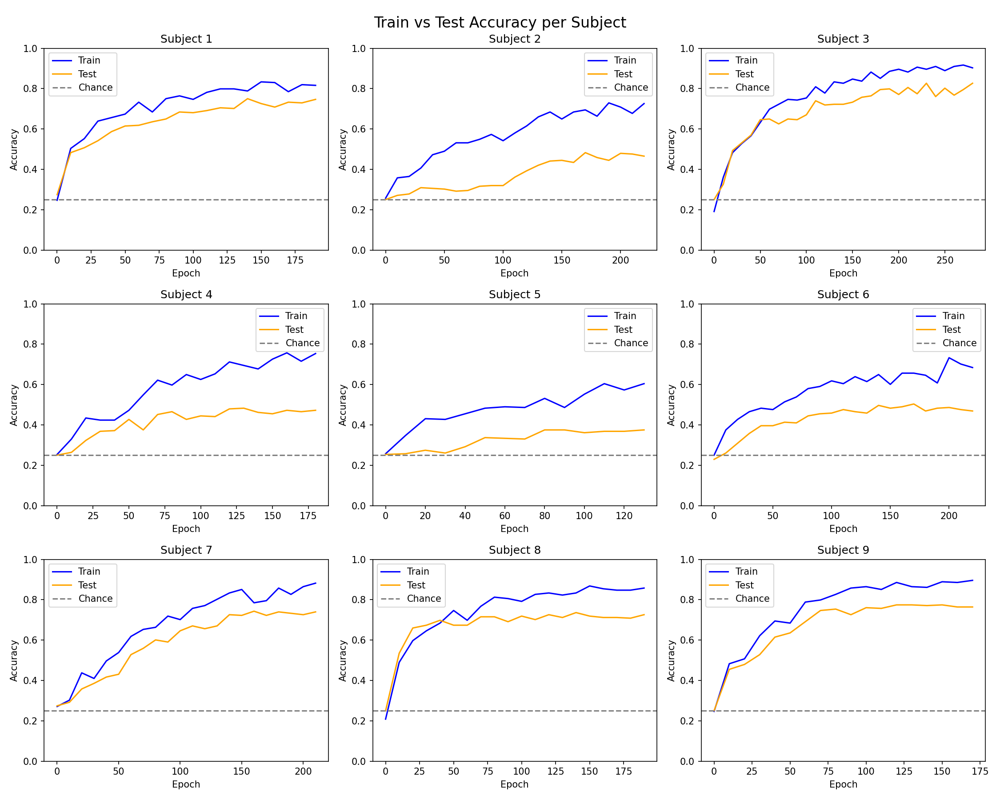
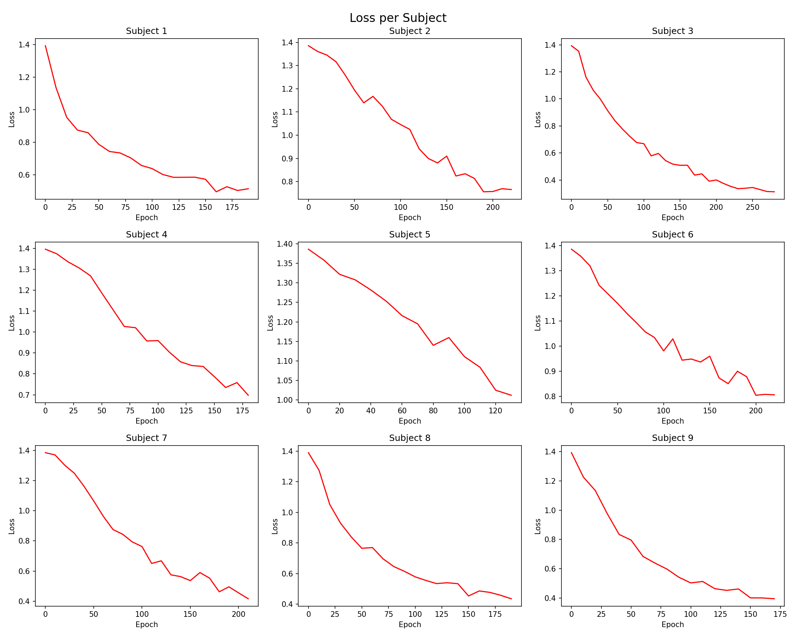
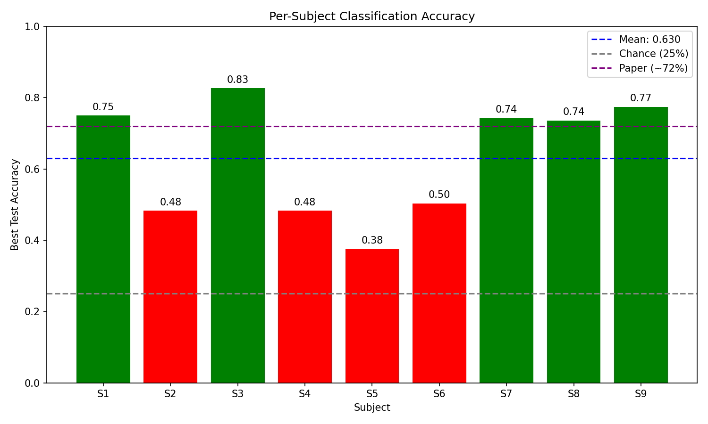

# EEGNet — PyTorch Reimplementation

A clean, from-scratch PyTorch reimplementation of **EEGNet** (Lawhern et al., 2018), a compact convolutional neural network for EEG-based brain-computer interfaces (BCIs). Trained and evaluated on the BCI Competition IV Dataset 2a (4-class motor imagery).

---

## Overview

EEGNet is a compact, generalizable CNN designed specifically for EEG signal classification. It uses depthwise and separable convolutions to learn both temporal and spatial EEG features with very few parameters (~1,972 for the 2-second epoch configuration).

This project reimplements the full pipeline from scratch:
- Paper-accurate architecture with weight constraints and correct regularization
- Full preprocessing pipeline using MNE (bandpass filtering, resampling, epoching, normalization)
- Subject-dependent training and evaluation following the paper's protocol
- Early stopping and best accuracy tracking across 9 subjects

---

## Architecture

```
Input: (batch, 1, 22, 256)
         ↓
Block 1: Temporal Conv (1 × 64) → BatchNorm
         ↓
Block 2: Depthwise Spatial Conv (22 × 1) → BatchNorm → ELU → AvgPool(1×4) → Dropout(0.5)
         ↓
Block 3: Separable Conv (1 × 16) → BatchNorm → ELU → AvgPool(1×8) → Dropout(0.25)
         ↓
Classifier: Flatten → Linear(128, 4)
         ↓
Output: (batch, 4)
```

**Key hyperparameters** (from paper Table 1):

| Parameter | Value |
|---|---|
| F1 (temporal filters) | 8 |
| D (depth multiplier) | 2 |
| F2 (separable filters) | 16 |
| Kernel length | 64 (= fs/2 at 128 Hz) |
| Dropout | 0.5 / 0.25 |
| Total parameters | 1,972 |

---

## Dataset

**BCI Competition IV Dataset 2a** — 4-class motor imagery EEG

- 9 subjects, recorded across 2 sessions (train/test on separate days)
- 22 EEG channels, 250 Hz (resampled to 128 Hz)
- 4 classes: Left Hand, Right Hand, Feet, Tongue
- 288 trials per session per subject

**Preprocessing pipeline:**
```
Raw .gdf (250 Hz)
    → Drop EOG channels
    → Bandpass filter (4–38 Hz)
    → Resample to 128 Hz
    → Epoch at [0.5, 2.5]s post cue onset
    → Per-trial z-score normalization
    → Shape: (288, 1, 22, 256)
```

---

## Results

Training protocol: subject-dependent, train on `A0XT.gdf`, evaluate on `A0XE.gdf`.

| Subject | Best Test Accuracy |
|---|---|
| S1 | 75.0% |
| S2 | 48.0% |
| S3 | **83.0%** |
| S4 | 48.0% |
| S5 | 38.0% |
| S6 | 50.0% |
| S7 | 74.0% |
| S8 | 74.0% |
| S9 | 77.0% |
| **Mean ± Std** | **63.0% ± 15.1%** |

Paper reports ~72% mean accuracy. The gap is largely explained by subjects 2, 4, 5, and 6 who show high session variability — a known challenge in cross-session BCI.

### Training Curves







---

## Project Structure

```
EEGNet/
├── data/
│   └── loader.py        # MNE-based preprocessing pipeline
├── models/
│   └── eegnet.py        # EEGNet architecture + weight constraints
├── scripts/
│   └── train.py         # Entry point — runs all 9 subjects
├── training/
│   └── trainer.py       # Training loop with early stopping
├── utils/
│   ├── augmentation.py  # Data augmentation utilities
│   └── plot_results.py  # Accuracy and loss visualizations
```

---

## How to Run

**1. Install dependencies:**
```bash
pip install -r requirements.txt
```

**2. Download the dataset:**
- BCI Competition IV Dataset 2a: https://www.bbci.de/competition/iv/
- Place `.gdf` files in `data/BCICIV_2a_gdf/`
- Download evaluation labels from https://www.bbci.de/competition/iv/results/ds2a/true_labels.zip
- Place `.mat` files in the same folder

**3. Run training:**
```bash
python scripts/train.py
```

---

## Key Implementation Notes

- **Kernel length = fs/2**: The temporal conv kernel is set to `sampling_rate / 2 = 64` samples at 128 Hz, covering the full frequency range of interest per Nyquist theorem
- **Softmax omitted**: Raw logits are output and softmax is absorbed into `nn.CrossEntropyLoss` during training
- **Weight constraints**: Max-norm constraints applied after every gradient step (spatial conv: 1.0, classifier: 0.25) to prevent overfitting
- **Per-trial normalization**: Z-score normalization per trial per channel is critical for cross-session generalization — without it, test accuracy collapses to ~25% (chance)
- **Early stopping**: Training stops when test accuracy shows no improvement for 50 epochs; best accuracy is reported

---

## References

Lawhern, V. J., Solon, A. J., Waytowich, N. R., Gordon, S. M., Hung, C. P., & Lance, B. J. (2018). EEGNet: A compact convolutional neural network for EEG-based brain-computer interfaces. *Journal of Neural Engineering*, 15(5), 056013.
